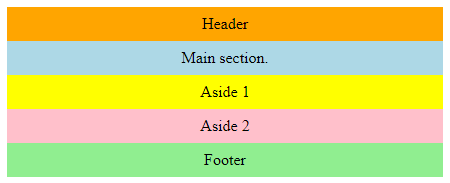
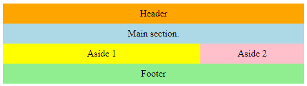
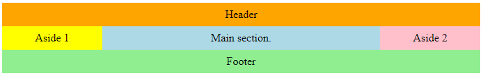

## Responsive Columns - Media Queries - Flexbox - flex-grow  -  flex-shrink
 layouts for mobile  tablet  desktop browsers.

## See below for example screenshots :

Screens under 480px:

Screens between 480 and 640px:

Screens over 640px:

